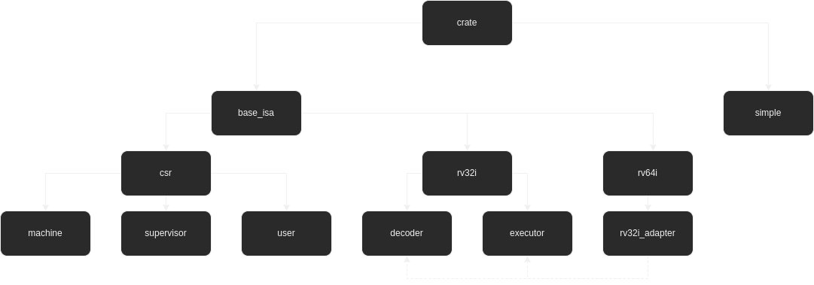

# Riv Emu

Easily extendable library to emulate RISC-V.

- [Git](https://gitlab.com/nerds-forge/rivemu)
- [Issues & Bugs](https://gitlab.com/nerds-forge/rivemu/-/issues/new)

## Features
List of planed and implemented features. And a list of features that are considered stable

### Implementation status

 - [x] rv32i
 - [ ] Zicsr
     - [ ] Machine
     - [ ] Supervisor
     - [ ] User
 - [ ] A
 - [ ] M
 - [ ] F
 - [ ] D

### Release status

 - [ ] rv32i
 - [ ] Zicsr
     - [ ] Machine
     - [ ] Supervisor
     - [ ] User
 - [ ] A
 - [ ] M
 - [ ] F
 - [ ] D

## Installation

    cargo install --git "https://gitlab.com/nerds-forge/rivemu.git" --branch "latest"

## Usage

    run_riv_emu <path/to/memory/image> [<load address in hex> [<number of cycles>]]

### Creation of a memory image

    clang --target=riscv32 -march=rv32i -c -o <output/file> <input/file>

    ld.lld -nostdlib --script=<linker/script> -o <output/file> <input/files>+

    llvm-objcopy -O binary <input/file> <output/file>

### Example linker script and startup.s

#### rivemu_rv32i.ld

```
    ENTRY(IRQ_reset)

    MEMORY
    {
        MEM (rwx): org = 0x00000000, len = 1M
    }

    SECTIONS
    {  
        .text : {
            . = 0x00000000;
            *(.irq)

            . = 0x00000040;
            */rivemu_rv32i_startup.o (.text)
            */rivemu_rv32i_startup.o (.data)
            */rivemu_rv32i_startup.o (.bss)

            *(.text)
            *(.data)
            *(.bss)
            *(.rodata)

            *(.text*)
            *(.data*)
            *(.bss*)
            *(.rodata*)
        }
    }
```

#### rivemu_rv32i_startup.s

```
    .global IRQH_reset
    .weak IRQH_reset
    
    .global IRQH_ebreak
    .weak IRQH_ebreak
    
    .global IRQH_m_ecall
    .weak IRQH_m_ecall
    
    .global IRQH_s_ecall
    .weak IRQH_s_ecall
    
    .global IRQH_u_ecall
    .weak IRQH_u_ecall
    
    .global IRQH_illegal_instruction
    .weak IRQH_illegal_instruction
    
    .global IRQH_instruction_address_misaligned
    .weak IRQH_instruction_address_misaligned
    
    .section .irq
    .word IRQH_reset
    .word IRQH_ebreak
    .word IRQH_m_ecall
    .word IRQH_s_ecall
    .word IRQH_u_ecall
    .word IRQH_illegal_instruction
    .word IRQH_instruction_address_misaligned
    .word 0
    .word 0
    .word 0
    .word 0
    .word 0
    .word 0
    .word 0
    .word 0
    .word 0
    
    .text
    
    IRQH_reset:
        call main
        j END_OF_CODE
    
    IRQH_ebreak:
        j END_OF_CODE
    
    IRQH_ecall:
        j END_OF_CODE
    
    IRQH_illegal_instruction:
        j END_OF_CODE
    
    IRQH_instruction_address_misaligned:
        j END_OF_CODE
    
    END_OF_CODE:
        j END_OF_CODE
``` 

## Module diagram



## Authors and Copyright
Copyright (C) 2022 Jonathan Schild - MIT License

 - Jonathan Schild